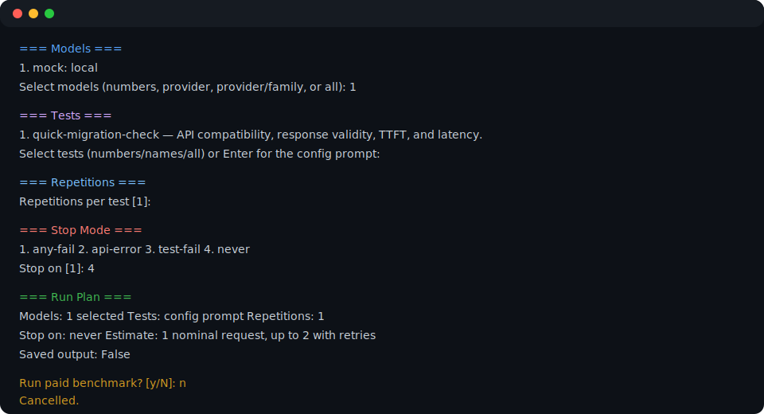

# Interactive benchmark mode

Interactive mode is the guided form of a normal benchmark. Use it when you want
to decide the models and tests at the terminal, then see the paid-work plan
before anything is sent:

```bash
llm-preflight benchmark.json --interactive
```

For the fastest non-interactive decision, run this first:

```bash
llm-preflight benchmark.json --migration-check --dry-run
llm-preflight benchmark.json --migration-check
```

It runs the three `quick-migration-check` response-contract cases once per
selected model.
Use interactive mode next when you need to choose a deeper task contract and
repetitions.

It has three stages:

1. **Select** — choose models, tests, repetitions, and when to stop.
2. **Preview** — read the exact request count, retry maximum, estimated cost,
   retention setting, and per-test breakdown.
3. **Run** — type `y` only when the plan is right. The paid-run confirmation is
   always separate from stop-mode selection, so a stray `y` there cannot start a
   request. Progress reports distinguish
   `API FAIL` from `API OK / TEST FAIL`.



This capture uses the no-key mock config created by `llm-preflight --init`. It was
cancelled at confirmation, so it made no network or paid request.

## How to answer the prompts

- Models: enter numbers, a provider such as `openai`, a provider/family such as
  `openrouter/qwen`, or `all`.
- If `provider/model-id` exactly matches one listed model, it selects that exact
  model rather than similarly named hyphenated variants.
- Tests: enter numbers, names, or `all`. Press Enter to use the config's
  default prompt instead of a built-in test suite.
- Stop mode: choose whether to stop on an API error, failed test, either, or
  **never**. “Never” is the menu wording for “run every selected model”; on the
  command line, simply omit `--stop-on`.
- Retry safety: if retries could exceed `max_requests`, the screen requires the
  exact `ACCEPT N` value. A typo explains the required text and lets you try
  again; Enter cancels.

Use smoke mode when you only need a low-cost compatibility check. It still makes
live requests. One repetition answers “did it work here?”; it does not establish
a reliable latency or quality ranking.

## Catalogue work is separate on purpose

`catalog probe` has a small selector and confirmation screen too, but it is not
an interactive benchmark. It sends one minimal compatibility request for a
text candidate and records no response text. Run it before creating a candidate
plan only when the catalogue labels a model **Needs one probe**:

```bash
llm-preflight catalog probe benchmarks/watch.json
```

The paid comparison remains one consistent flow:

```bash
llm-preflight benchmarks/candidates.json --interactive \
  --approve-to benchmarks/approved.json
```

After a saved run, `--approve-to` offers passing candidate models for explicit
approval. It never adds them silently.

Interactive benchmark mode cannot be combined with `--catalog`, `--tests`,
`--profiles`, `--prompt`, or `--migration-check`. For scripted equivalents and
every flag, see the
[CLI reference](cli-reference.md). For the complete model lifecycle, see
[Model catalogue](model-watch.md).
